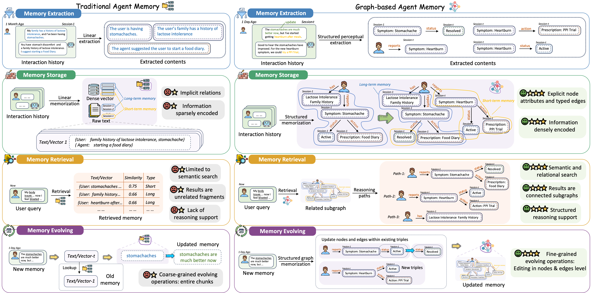
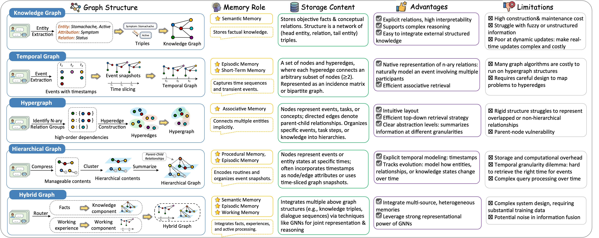

# Awesome Graph-based Agent Memory

<div align="center">
     <a href="https://arxiv.org/abs/2602.05665" target="_blank"></a>
     <a href="http://makeapullrequest.com"></a>
     <a href="https://drive.google.com/file/d/1svybBAKkuX6AYbikXzc9L_8wgrABxGJU/view?usp=sharing"></a>
     <a href="http://makeapullrequest.com"></a>
     <a href="http://makeapullrequest.com"></a>
   
</div>

This repository provides a comprehensive collection of research papers, benchmarks, and open-source projects on **Graph-based Agent Memory**. It includes contents from our survey paper 📖<em>"[**Graph-based Agent Memory: Taxonomy, Techniques, and Applications**](https://arxiv.org/pdf/2602.05665)"</em> and will be continuously updated.

🤗 **You are vey welcome to contribute to this repository** by launching an issue or a pull request. If you find any missing resources or come across interesting new research works, please don’t hesitate to open an issue or submit a PR!

📫 **Contact us via emails:** `chang.yang@connect.polyu.hk`, `qinggang.zhang@polyu.edu.hk`

---

<div>
<h3 align="center">
       <p align="center"></p>
    <p align="center"><em>Comparison between Traditional Agent Memory and Graph-based Agent Memory.</em></p>
</div>

## 📜 Catalog

> **[Awesome Graph-based Agent Memory](#awesome-graph-based-agent-memory)**
>
> - **[🔥 News](#-news)**
> - **[📖 Overview](#-overview)**
> - **[📚 Related Survey](#-survey)**
> - **[🪴 Taxonomy](#-taxonomy)**
>   - [Memory Extraction](#memory-extraction)
>   - [Memory Storage](#memory-storage)
>   - [Memory Retrieval](#memory-retrieval)
>   - [Memory Evolution](#memory-evolution)
> - **[🏆 Benchmark](#-benchmark)**
> - **[📦 Projects](#-projects)**
> - **[📃 Citation](#-citation)**

---

## 🔥 News

* **[2025-02-03]** 🔥🔥 Our survey on Graph-based Agent Memory is released.


## 📚 Related Survey Papers
- (TOIS'25) **A Survey on the Memory Mechanism of Large Language Model-based Agents** [[Paper]](https://dl.acm.org/doi/full/10.1145/3748302)
- (TMLR'25) **The AI Hippocampus: How Far are We From Human Memory?** [[Paper]](https://openreview.net/forum?id=Sk7pwmLuAY)
- (arXiv'25) **Memory in the Age of AI Agents** [[Paper]](https://arxiv.org/abs/2512.13564)
- (arXiv'25) **Memory in LLM-based Multi-agent Systems: Mechanisms, Challenges, and Collective Intelligence** [[Paper]](https://www.techrxiv.org/doi/full/10.36227/techrxiv.176539617.79044553)
- (arXiv'25) **AI Meets Brain: Memory Systems from Cognitive Neuroscience to Autonomous Agents** [[Paper]](https://arxiv.org/abs/2512.23343)
- (arXiv'25) **From Human Memory to AI Memory: A Survey on Memory Mechanisms in the Era of LLMs** [[Paper]](https://arxiv.org/abs/2504.15965)


## 🪴 Taxonomy

### Memory Extraction

<p align="center"></p>

#### Textual Data

- (arXiv‘25) **Can an LLM Induce a Graph? Investigating Memory Drift and Context Length** [[Paper]](https://arxiv.org/pdf/2510.03611)
- (arXiv‘24) **On the structural memory of llm agents** [[Paper]](https://arxiv.org/pdf/2412.15266?)
- (arXiv‘25) **Personaagent with graphrag: Community-aware knowledge graphs for personalized llm** [[Paper]](https://arxiv.org/abs/2511.17467)
- (arXiv‘25) **Scaling graph chain-of-thought reasoning: A multi-agent framework with efficient llm serving** [[Paper]](https://arxiv.org/pdf/2511.01633)
- (ACL‘25) **HiAgent: Hierarchical Working Memory Management for Solving Long-Horizon Agent Tasks with Large Language Model** [[Paper]](https://aclanthology.org/2025.acl-long.1575.pdf)

#### Sequential Data
- (NeurIPS‘23) **Reflexion: Language agents with verbal reinforcement learning** [[Paper]](https://proceedings.neurips.cc/paper_files/paper/2023/file/1b44b878bb782e6954cd888628510e90-Paper-Conference.pdf)
- (arXiv‘25) **Mem-α: Learning Memory Construction via Reinforcement Learning** [[Paper]](https://arxiv.org/abs/2509.25911)

#### Multimodal Data
- (arXiv‘25) **MemoryVLA: Perceptual-Cognitive Memory in Vision-Language-Action Models for Robotic Manipulation** [[Paper]](https://arxiv.org/abs/2508.19236)
- (arXiv‘23) **Multi-Temporal Lip-Audio Memory for Visual Speech Recognition** [[Paper]](https://arxiv.org/abs/2305.04542)
- (NeurIPS‘24) **Optimus-1: Hybrid multimodal memory empowered agents excel in long-horizon tasks**[[Paper]](https://proceedings.neurips.cc/paper_files/paper/2024/hash/5949a8750a110ce1f0631b1776c500a2-Abstract-Conference.html)

### Memory Storage
<p align="center"></p>

#### Knowledge Graph Structure

- (TMLR'25) **MemLLM: Finetuning LLMs to Use An Explicit Read-Write Memory**  [[Paper]](https://arxiv.org/abs/2404.11672)
- (arXiv'25) **AriGraph: Learning Knowledge Graph World Models with Episodic Memory for LLM Agents** [[Paper]](https://arxiv.org/abs/2407.04363)
- (arXiv'25) **Mem0: Building Production-Ready AI Agents with Scalable Long-Term Memory** [[Paper]](https://arxiv.org/abs/2504.19413)

#### Hierarchical Memory Structure

- (arXiv'25) **ENGRAM: Effective, Lightweight Memory Orchestration for Conversational Agents** [[Paper]](https://arxiv.org/abs/2511.12960)
- (arXiv'25) **SGMem: Sentence Graph Memory for Long-Term Conversational Agents** [[Paper]](https://arxiv.org/abs/2509.21212)
- (arXiv'25) **G-Memory: Tracing Hierarchical Memory for Multi-Agent Systems** [[Paper]](https://arxiv.org/abs/2506.07398)
- (arXiv'25) **LLM-Powered Decentralized Generative Agents with Adaptive Hierarchical Knowledge Graph for Cooperative Planning** [[Paper]](https://arxiv.org/abs/2502.05453)
- (EMNLP'24) **Crafting Personalized Agents through Retrieval-Augmented Generation on Editable Memory Graphs** [[Paper]](https://arxiv.org/abs/2409.19401)

#### Temporal Graph Structure

- (arXiv'25) **Zep: A Temporal Knowledge Graph Architecture for Agent Memory** [[Paper]](https://arxiv.org/abs/2501.13956)
- (arXiv'25) **TReMu: Towards Neuro-Symbolic Temporal Reasoning for LLM-Agents with Memory in Multi-Session Dialogues** [[Paper]](https://arxiv.org/abs/2502.01630)
- (arXiv'25) **MemoTime: Memory-Augmented Temporal Knowledge Graph Enhanced Large Language Model Reasoning** [[Paper]](https://arxiv.org/abs/2510.13614)

#### Hypergraph Structure

- (arXiv'25) **HyperGraphRAG: Retrieval-Augmented Generation via Hypergraph-Structured Knowledge Representation** [[Paper]](https://arxiv.org/abs/2503.21322)
- (arXiv'25) **HyperG: Hypergraph-Enhanced LLMs for Structured Knowledge** [[Paper]](https://arxiv.org/abs/2502.18125)

#### Hybrid Graph Architectures

- (arXiv'24) **Optimus-1: Hybrid Multimodal Memory Empowered Agents Excel in Long-Horizon Tasks** [[Paper]](https://arxiv.org/abs/2408.03615)
- (arXiv'24) **KG-Agent: An Efficient Autonomous Agent Framework for Complex Reasoning over Knowledge Graph** [[Paper]](https://arxiv.org/abs/2402.11163)

### Memory Retrieval

<p align="center"></p>


#### Retrieval Techniques

##### Similarity-based
- (CVPR'25) **Seeing, Listening, Remembering, and Reasoning: A Multimodal Agent with Long-Term Memory** [[Paper]](https://arxiv.org/abs/2508.09736)
- (aXiv'25) **Zep: a temporal knowledge graph architecture for agent memory**. [[paper]](https://arxiv.org/abs/2501.13956)
- (aXiv'25) **Mem0: Building production-ready ai agents with scalable long-term memory**. [[paper]](https://arxiv.org/abs/2504.19413)
- (arXiv'25) **G-Memory: Tracing Hierarchical Memory for Multi-Agent Systems** [[Paper]](https://arxiv.org/abs/2506.07398)

##### Rule-based
- (arXiv'25) **MemInsight: Autonomous Memory Augmentation for LLM Agents** [[Paper]](https://arxiv.org/abs/2503.21760)
- (arXiv'25) **Neural Graph Memory: A Structured Approach to Long-Term Memory in Multimodal Agents** [[Paper]](https://www.researchgate.net/publication/394440420_Neural_Graph_Memory_A_Structured_Approach_to_Long-Term_Memory_in_Multimodal_Agents)
- (IEEE Trans. Big Data) **FinMem: A Performance-Enhanced LLM Trading Agent with Layered Memory and Character Design** [[Paper]](https://arxiv.org/abs/2311.13743)
- (CHI'24) **"My agent understands me better": Integrating Dynamic Human-like Memory Recall and Consolidation in LLM-Based Agents** [[Paper]](https://arxiv.org/abs/2404.00573)
- (ACL'25 Findings) **TReMu: Towards Neuro-Symbolic Temporal Reasoning for LLM-Agents with Memory in Multi-Session Dialogues** [[Paper]](https://arxiv.org/abs/2502.01630)

##### Graph-based
- (aXiv'25) **Mem0: Building production-ready ai agents with scalable long-term memory**. [[paper]](https://arxiv.org/abs/2504.19413)
- (aXiv'25) **Zep: a temporal knowledge graph architecture for agent memory**. [[paper]](https://arxiv.org/abs/2501.13956)
- (arXiv'25) **G-Memory: Tracing Hierarchical Memory for Multi-Agent Systems** [[Paper]](https://arxiv.org/abs/2506.07398)
- (arXiv'25) **SGMem: Sentence Graph Memory for Long-Term Conversational Agents** [[Paper]](https://arxiv.org/abs/2509.21212)
- (arXiv'25) **Hierarchical Memory for High-Efficiency Long-Term Reasoning in LLM Agents** [[Paper]](https://arxiv.org/abs/2507.22925)
- (arXiv'25) **LiCoMemory: Lightweight and Cognitive Agentic Memory for Efficient Long-Term Reasoning** [[Paper]](https://arxiv.org/abs/2511.01448)

##### Temporal-based

- (arXiv'25) **AssoMem: Scalable Memory QA with Multi-Signal Associative Retrieval** [[Paper]](https://arxiv.org/abs/2510.10397)
- (arXiv'25) **Mnemosyne: An Unsupervised, Human-Inspired Long-Term Memory Architecture for Edge-Based LLMs** [[Paper]](https://arxiv.org/abs/2510.08601)
- (aXiv'25) **Zep: a temporal knowledge graph architecture for agent memory**. [[paper]](https://arxiv.org/abs/2501.13956)
- (arXiv'25) **LiCoMemory: Lightweight and Cognitive Agentic Memory for Efficient Long-Term Reasoning** [[Paper]](https://arxiv.org/abs/2511.01448)
- (arXiv'25) **MemoTime: Memory-Augmented Temporal Knowledge Graph Enhanced Large Language Model Reasoning** [[Paper]](https://arxiv.org/abs/2510.13614)

##### RL-based
- (EMNLP'24) **Crafting Personalized Agents through Retrieval-Augmented Generation on Editable Memory Graphs** [[Paper]](https://arxiv.org/abs/2409.19401)
- (arXiv'25) **Memento: Fine-tuning LLM Agents without Fine-tuning LLMs** [[Paper]](https://arxiv.org/abs/2508.16153)
- (arXiv‘25) **Mem-α: Learning Memory Construction via Reinforcement Learning** [[Paper]](https://arxiv.org/abs/2509.25911)
- (arXiv'25) **From Experience to Strategy: Empowering LLM Agents with Trainable Graph Memory** [[Paper]](https://arxiv.org/abs/2511.07800)
- (arXiv'25) **Memory-augmented Query Reconstruction for LLM-based Knowledge Graph Reasoning** [[Paper]](https://arxiv.org/abs/2503.05193)
- (aXiv'25) **Memory-r1: Enhancing large language model agents to manage and utilize memories via reinforcement learning**. [[paper]](https://arxiv.org/abs/2508.19828)
- (ACL'25) **In Prospect and Retrospect: Reflective Memory Management for Long-term Personalized Dialogue Agents** [[Paper]](https://arxiv.org/abs/2503.08026)


##### Agent-based


- [Arxiv'24] **Leveraging knowledge graph-based human-like memory systems to solve partially observable markov decision processes**. [[paper]](https://arxiv.org/abs/2408.05861)
- [Arxiv'24] **Arigraph: Learning knowledge graph world models with episodic memory for llm agents**. [[paper]](https://arxiv.org/abs/2407.04363)
- [NeurIPS'24] **Optimus-1: Hybrid multimodal memory empowered agents excel in long-horizon tasks**. [[paper]](https://openreview.net/forum?id=XXOMCwZ6by&referrer=%5Bthe%20profile%20of%20Dongmei%20Jiang%5D(%2Fprofile%3Fid%3D~Dongmei_Jiang2))
- [Arxiv'25] **Omni Memory System for Personalized, Long Horizon, Self-Evolving Agents**. [[paper]](https://arxiv.org/abs/2511.13593)
- [ICML'25] **Cradle: Empowering Foundation Agents towards General Computer Control**. [[paper]](https://icml.cc/virtual/2025/poster/46393)
- [Arxiv'25] **Llm-powered decentralized generative agents with adaptive hierarchical knowledge graph for cooperative planning**. [[paper]](https://arxiv.org/abs/2502.05453)
- [Arxiv'25] **MemGPT: Towards LLMs as Operating Systems**. [[paper]](https://arxiv.org/abs/2310.08560)
- [Arxiv'25] **Cognitive Architectures for Language Agents**. [[paper]](https://arxiv.org/abs/2407.04363)
- [ACL'25] **Hiagent: Hierarchical working memory management for solving long-horizon agent tasks with large language model**. [[paper]](https://aclanthology.org/2025.acl-long.1575.pdf)
- [Arxiv'25] **GraphCogent: Mitigating LLMs' Working Memory Constraints via Multi-Agent Collaboration in Complex Graph Understanding**. [[paper]](https://arxiv.org/abs/2508.12379)
- (Arxiv'25) **Memory-r1: Enhancing large language model agents to manage and utilize memories via reinforcement learning**. [[paper]](https://arxiv.org/abs/2508.19828)
- (Arxiv'25) **Enhancing Multi-Agent Systems via Reinforcement Learning with LLM-based Planner and Graph-based Policy**. [[paper]](https://arxiv.org/abs/2503.10049)
- (Arxiv'25) **Collaborative Memory: Multi-User Memory Sharing in LLM Agents with Dynamic Access Control**. [[paper]](https://arxiv.org/abs/2505.18279)
- [Arxiv'26] **SwiftMem: Fast Agentic Memory via Query-aware Indexing** [[paper]](https://arxiv.org/pdf/2601.08160)


#### Retrieval Strategy

##### Multi-round Retrieval


- [arXiv'25] **General Agentic Memory Via Deep Research**. [[paper]](https://arxiv.org/abs/2511.18423)
- [ACL'25 Findings] **Bridging intuitive associations and deliberate recall: Empowering llm personal assistant with graph-structured long-term memory**. [[paper]](https://aclanthology.org/2025.findings-acl.901/)
- [arXiv'25] **Rcr-router: Efficient role-aware context routing for multi-agent llm systems with structured memory**. [[paper]](https://arxiv.org/abs/2508.04903)
- [arXiv'25] **MemSearcher: Training LLMs to Reason, Search and Manage Memory via End-to-End Reinforcement Learning**. [[paper]](https://arxiv.org/abs/2511.02805)
- [arXiv'25] **MemoTime: Memory-Augmented Temporal Knowledge Graph Enhanced Large Language Model Reasoning**. [[paper]](https://arxiv.org/abs/2510.13614)
- [arXiv'25] **On the structural memory of llm agents**. [[paper]](https://arxiv.org/abs/2412.15266)
- [arXiv'25] **LEGOMem: Modular Procedural Memory for Multi-agent LLM Systems for Workflow Automation**. [[paper]](https://arxiv.org/abs/2510.04851)
- [arXiv'25] **Ghost in the minecraft: Generally capable agents for open-world environments via large language models with text-based knowledge and memory**. [[paper]](https://arxiv.org/abs/2305.17144)


##### Post-Retrieval 


- [ACL'25 Findings] **Simgrag: Leveraging similar subgraphs for knowledge graphs driven retrieval-augmented generation**. [[paper]](https://aclanthology.org/2025.findings-acl.163/)
- [arXiv'25] **Mirix: Multi-agent memory system for llm-based agents**. [[paper]](https://arxiv.org/abs/2507.07957)
- [arXiv'25] **MemGen: Weaving Generative Latent Memory for Self-Evolving Agents**. [[paper]](https://arxiv.org/abs/2509.24704)


##### Multi-Source Retrieval


- [arXiv'25] **MemSearcher: Training LLMs to Reason, Search and Manage Memory via End-to-End Reinforcement Learning**. [[paper]](https://arxiv.org/abs/2511.02805)
- [arXiv'25] ** MEM1: Learning to Synergize Memory and Reasoning for Efficient Long-Horizon Agents**. [[paper]](https://arxiv.org/abs/2506.15841)


### Memory Evolution

<p align="center"></p>


#### Internal Self-Evolving


- (aXiv'25) **Zep: a temporal knowledge graph architecture for agent memory**. [[paper]](https://arxiv.org/abs/2501.13956)
- (aXiv'25) **Nemori: Self-organizing agent memory inspired by cognitive science**. [[paper]](https://arxiv.org/abs/2508.03341)
- (aXiv'25) **Mem-α: Learning Memory Construction via Reinforcement Learning**. [[paper]](https://arxiv.org/abs/2509.25911)
- (aXiv'24) **From local to global: A graph rag approach to query-focused summarization**. [[paper]](https://arxiv.org/abs/2404.16130)
- (aXiv'23) **RecallM: An Adaptable Memory Mechanism with Temporal Understanding for Large Language Models**. [[paper]](https://arxiv.org/abs/2307.02738)
- (aXiv'25) **Agent kb: Leveraging cross-domain experience for agentic problem solving**. [[paper]](https://arxiv.org/abs/2507.06229)
- (aXiv'25) **Mem0: Building production-ready ai agents with scalable long-term memory**. [[paper]](https://arxiv.org/abs/2504.19413)
- (aXiv'25) **Flex: Continuous agent evolution via forward learning from experience**. [[paper]](https://arxiv.org/abs/2511.06449)
- (NeurIPS'23) **Reflexion: language agents with verbal reinforcement learning**. [[paper]](https://openreview.net/pdf?id=vAElhFcKW6) 
- (ICLR'24) **Think-on-Graph: Deep and Responsible Reasoning of Large Language Model on Knowledge Graph**. [[paper]](https://openreview.net/forum?id=nnVO1PvbTv)
- (TKDE'26) **Reliable Reasoning Path: Distilling Effective Guidance for LLM Reasoning With Knowledge Graphs**. [[paper]](https://arxiv.org/abs/2506.10508)
- (ICLR'24) **Reasoning on Graphs: Faithful and Interpretable Large Language Model Reasoning**. [[paper]](https://openreview.net/forum?id=ZGNWW7xZ6Q)
- (AAAI'24) **Memorybank: Enhancing large language models with long-term memory**. [[paper]](https://arxiv.org/abs/2305.10250)
- (EMNLP'25) **Memory OS of AI Agent**. [[paper]](https://aclanthology.org/2025.emnlp-main.1318.pdf)
- (aXiv'23) **MemGPT: Towards LLMs as Operating Systems**. [[paper]](https://arxiv.org/abs/2310.08560)
- (ICML'25) **From RAG to Memory: Non-Parametric Continual Learning for Large Language Models**. [[paper]](https://openreview.net/forum?id=LWH8yn4HS2)

#### External Self-Exploration

- (AAAI'24) **Expel: Llm agents are experiential learners**. [[paper]](https://arxiv.org/abs/2308.10144)
- (ICRA'24) **MATRIX: multi-agent trajectory generation with diverse contexts**. [[paper]](https://arxiv.org/abs/2403.06041)
- (aXiv'25) **Memory-r1: Enhancing large language model agents to manage and utilize memories via reinforcement learning**. [[paper]](https://arxiv.org/abs/2508.19828)
- (aXiv'25) **Inside-out: Hidden factual knowledge in llms**. [[paper]](https://arxiv.org/abs/2503.15299)
- (aXiv'25) **Memevolve: Meta-evolution of agent memory systems**. [[paper]](https://arxiv.org/abs/2512.18746)
- (aXiv'26) **Beyond static summarization: Proactive memory extraction for llm agents**. [[paper]](https://arxiv.org/abs/2601.04463)
- (aXiv'25) **Agentevolver: Towards efficient self-evolving agent system**. [[paper]](https://arxiv.org/abs/2511.10395)
- (TechReport_Moonshot'25) **Kimi K2.5**. [[paper]](https://www.kimi.com/blog/kimi-k2-5.html)


# 🏆 Benchmarks
| Dataset | Scenario | Modality | Feature | Paper | Repo |
| :--- | :--- | :--- | :--- | :--- | :--- |
| LoCoMo | Interaction | Text+Image | Long conversational memory | [[Paper]](https://arxiv.org/abs/2402.17753) | [[Website]](https://snap-research.github.io/locomo/) |
| LongMemEval | Interaction | Text | Long-term interactive memory | [[Paper]](https://arxiv.org/abs/2410.10813) | [[Github]](https://github.com/xiaowu0162/LongMemEval) |
| MemoryAgentBench | Interaction | Text | Multi-turn interactions | [[Paper]](https://arxiv.org/abs/2507.05257) | [[Github]](https://github.com/HUST-AI-HYZ/MemoryAgentBench) |
| MEMTRACK | Interaction | Text+Code+Logs | Long-term interactive memory | [[Paper]](https://arxiv.org/abs/2510.01353) | [[Website]](https://arxiv.org/abs/2510.01353) |
| MADial-Bench | Interaction | Text | Memory-augmented dialogue generation | [[Paper]](https://arxiv.org/abs/2409.15240) | [[Github]](https://github.com/hejunqing/MADial-Bench) |
| MemSim | Interaction | Text | Bayesian memory simulation | [[Paper]](https://arxiv.org/abs/2409.20163) | [[Github]](https://github.com/nuster1128/MemSim) |
| ChMapData | Interaction | Text | Memory-aware proactive dialogue | [[Paper]](https://arxiv.org/abs/2503.05150) | [[Github]](https://github.com/FrontierLabs/MapDia) |
| MSC | Interaction | Text | Multi-session chat | [[Paper]](https://arxiv.org/abs/2107.07567) | [[Website]](https://parl.ai/projects/msc/) |
| MMRC | Interaction | Text+Image | Multi-modal real-world conversation | [[Paper]](https://arxiv.org/abs/2502.11903) | [[Github]](https://github.com/haochen-MBZUAI/MMRC) |
| MemBench | Interaction | Text | Interactive scenarios | [[Paper]](https://arxiv.org/abs/2506.21605) | [[Github]](https://github.com/import-myself/Membench) |
| StoryBench | Interaction | Text | Interactive fiction memory | [[Paper]](https://arxiv.org/abs/2506.13356) | [[Website]](https://arxiv.org/abs/2506.13356) |
| DialSim | Interaction | Text | Multi-dialogue understanding | [[Paper]](https://arxiv.org/abs/2406.13144) | [[Website]](https://arxiv.org/abs/2406.13144) |
| RealMem | Interaction | Text | Project-oriented long-term memory interaction | [[Paper]](https://arxiv.org/abs/2601.06966) | [[Github]](https://github.com/AvatarMemory/RealMemBench) |
| PersonaMem | Personalization | Text | Dynamic user profiling | [[Paper]](https://arxiv.org/abs/2504.14225) | [[Github]](https://github.com/bowen-upenn/PersonaMem) |
| PerLTQA | Personalization | Text | Social personalized interactions | [[Paper]](https://arxiv.org/abs/2402.16288) | [[Website]](https://arxiv.org/abs/2402.16288) |
| MemoryBank | Personalization | Text | User memory updating | [[Paper]](https://arxiv.org/abs/2305.10250) | [[Github]](https://github.com/zhongwanjun/MemoryBank-SiliconFriend) |
| MPR | Personalization | Text | User personalization | [[Paper]](https://arxiv.org/abs/2508.13250) | [[Github]](https://github.com/nuster1128/MPR) |
| PrefEval | Personalization | Text | Personal preferences | [[Paper]](https://arxiv.org/abs/2502.09597) | [[Website]](https://prefeval.github.io/) |
| LOCCO | Personalization | Text | Chronological conversations | [[Paper]](https://arxiv.org/abs/2505.04730) | [[Github]](https://github.com/JamesLLMs/LoCoGen) |
| WebChoreArena | Web | Text+Image | Tedious web browsing | [[Paper]](https://arxiv.org/abs/2506.01952) | [[Github]](https://github.com/WebChoreArena/WebChoreArena) |
| MT-Mind2Web | Web | Text | Conversational web navigation | [[Paper]](https://arxiv.org/abs/2402.15057) | [[Github]](https://github.com/magicgh/self-map) |
| WebShop | Web | Text+Image | E-commerce web interaction | [[Paper]](https://arxiv.org/abs/2207.01206) | [[Github]](https://github.com/princeton-nlp/WebShop) |
| WebArena | Web | Text+Image | Web interaction | [[Paper]](https://arxiv.org/abs/2307.13854) | [[Github]](https://github.com/web-arena-x/webarena) |
| MMInA | Web | Text+Image | Multihop web agent | [[Paper]](https://arxiv.org/abs/2503.00735) | [[Website]](https://mmina.cliangyu.com/) |
| NQ | LongContext | Text | Natural question answering | [[Paper]](https://arxiv.org/abs/1906.00300) | [[Website]](https://ai.google.com/research/NaturalQuestions) |
| TriviaQA | LongContext | Text | Large-scale question answering | [[Paper]](https://arxiv.org/abs/1705.03551) | [[Website]](http://nlp.cs.washington.edu/triviaqa/) |
| PopQA | LongContext | Text | Adaptive retrieval augmentation | [[Paper]](https://arxiv.org/abs/2305.09902) | [[Github]](https://github.com/AlexTMallen/adaptive-retrieval) |
| HotpotQA | LongContext | Text | Explainable multi-hop QA | [[Paper]](https://arxiv.org/abs/1809.09600) | [[Website]](https://hotpotqa.github.io/) |
| 2wikimultihopQA | LongContext | Text | Multi-hop QA | [[Paper]](https://arxiv.org/abs/2011.01060) | [[Github]](https://github.com/Alab-NII/2wikimultihop) |
| Musique | LongContext | Text | Multi-hop QA | [[Paper]](https://arxiv.org/abs/2202.09726) | [[Github]](https://github.com/stonybrooknlp/musique) |
| LongBench | LongContext | Text | Long-context understanding | [[Paper]](https://arxiv.org/abs/2308.14508) | [[Github]](https://github.com/THUDM/LongBench) |
| LongBench v2 | LongContext | Text | Long-context multitasks | [[Paper]](https://arxiv.org/abs/2412.15204) | [[Github]](https://github.com/THUDM/LongBench) |
| RULER | LongContext | Text | Long-context retrieval | [[Paper]](https://arxiv.org/abs/2404.06654) | [[Github]](https://github.com/NVIDIA/RULER) |
| BABILong | LongContext | Text | Long-context reasoning | [[Paper]](https://arxiv.org/abs/2406.10149) | [[Github]](https://github.com/booydar/babilong) |
| MM-Needle | LongContext | Text+Image | Multimodal needle retrieval | [[Paper]](https://arxiv.org/abs/2406.11230) | [[Website]](https://mmneedle.github.io/) |
| HaluMem | LongContext | Text | Memory hallucination eval | [[Paper]](https://arxiv.org/abs/2511.03506) | [[Github]](https://github.com/MemTensor/HaluMem) |
| MemoryBench | Continual | Text | Continual learning | [[Paper]](https://arxiv.org/abs/2510.17281) | [[Github]](https://github.com/LittleDinoC/MemoryBench) |
| LifelongAgentBench | Continual | Text | Lifelong learning | [[Paper]](https://arxiv.org/abs/2505.11942) | [[Website]](https://arxiv.org/abs/2505.11942) |
| StreamBench | Continual | Text | Continuous online learning | [[Paper]](https://arxiv.org/abs/2406.08747) | [[Website]](https://stream-bench.github.io/) |
| Evo-Memory | Continual | Text | Test-time learning | [[Paper]](https://arxiv.org/abs/2511.20857) | [[Website]](https://arxiv.org/abs/2511.20857) |
| Ego4D | Environments | Video+Audio | Egocentric episodic memory | [[Paper]](https://arxiv.org/abs/2110.07058) | [[Website]](https://ego4d-data.org/) |
| EgoLife | Environments | Video+Audio | Long-context life QA | [[Paper]](https://arxiv.org/abs/2503.03803) | [[Website]](https://egolife-ai.github.io/) |
| ALFWorld | Environments | Text | Household tasks | [[Paper]](https://arxiv.org/abs/2010.03768) | [[Website]](https://alfworld.github.io/) |
| BabyAI | Environments | Text | Language navigation | [[Paper]](https://arxiv.org/abs/1810.08272) | [[Website]](https://arxiv.org/abs/1810.08272) |
| ScienceWorld | Environments | Text | Multi-step science experiments | [[Paper]](https://arxiv.org/abs/2203.07540) | [[Github]](https://github.com/allenai/ScienceWorld) |
| AgentGym | Environments | Text | Multiple environments | [[Paper]](https://arxiv.org/abs/2406.04151) | [[Website]](https://agentgym.github.io/) |
| AgentBoard | Environments | Text | Multi-round interaction | [[Paper]](https://arxiv.org/abs/2401.13178) | [[Github]](https://github.com/hkust-nlp/AgentBoard) |
| SWE-Bench | Tool/Gen | Text+Code | Code repair | [[Paper]](https://arxiv.org/abs/2310.06770) | [[Website]](https://www.swebench.com/) |
| GAIA | Tool/Gen | Text | Deep research tasks | [[Paper]](https://arxiv.org/abs/2311.12983) | [[Website]](https://huggingface.co/gaia-benchmark) |
| xBench-DS | Tool/Gen | Text+Image | Deep-search evaluation | [[Paper]](https://arxiv.org/abs/2506.13651) | [[Website]](https://xbench.org/) |
| ToolBench | Tool/Gen | Text→API | API tool use | [[Paper]](https://arxiv.org/abs/2307.16789) | [[Github]](https://github.com/OpenBMB/ToolBench) |
| GenAI-Bench | Tool/Gen | Text+Image | Visual generation eval | [[Paper]](https://arxiv.org/abs/2406.13743) | [[Website]](https://arxiv.org/abs/2406.13743) |


# 💻 Open-source Project
- [](https://langchain-ai.github.io/langmem/) LangMem: a software development kit (SDK) from LangChain designed to give AI agents long-term memory
- [](https://github.com/zjunlp/LightMem) LightMem: Lightweight and efficient memory-augmented generation
- [](https://github.com/OPPO-PersonalAI/O-Mem) O-Mem: Omni memory system for personalized, long horizon, self-evolving agents
- [](https://github.com/CaviraOSS/OpenMemory) OpenMemory: A cognitive memory engine for LLMs and agents
- [](https://github.com/MemoriLabs/Memori) Memori: A system that gives your AI agents a structured, persistent memory layer
- [](https://github.com/MemMachine/MemMachine) MemMachine: A multi-layered memory system for AI agents
- [](https://github.com/kingjulio8238/Memary) Memary: A longterm memory for autonomous agents
- [](https://github.com/getzep/graphiti) Graphiti: A framework for building and querying temporally-aware knowledge graphs, specifically tailored for AI agents operating in dynamic environments
- [](https://github.com/memvid/memvid) Memvid: A single-file memory layer for AI agents with instant retrieval and long-term memory


## 📃 Citation

```
@misc{yang2026graphbasedagentmemorytaxonomy,
      title={Graph-based Agent Memory: Taxonomy, Techniques, and Applications}, 
      author={Chang Yang and Chuang Zhou and Yilin Xiao and Su Dong and Luyao Zhuang and Yujing Zhang and Zhu Wang and Zijin Hong and Zheng Yuan and Zhishang Xiang and Shengyuan Chen and Huachi Zhou and Qinggang Zhang and Ninghao Liu and Jinsong Su and Xinrun Wang and Yi Chang and Xiao Huang},
      year={2026},
      eprint={2602.05665},
      archivePrefix={arXiv},
      primaryClass={cs.AI},
      url={https://arxiv.org/abs/2602.05665}, 
}
```
