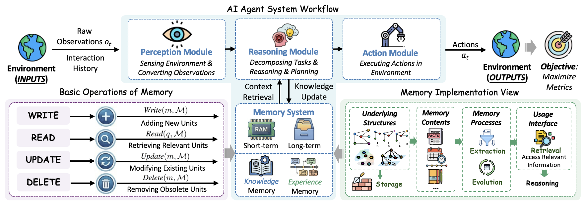
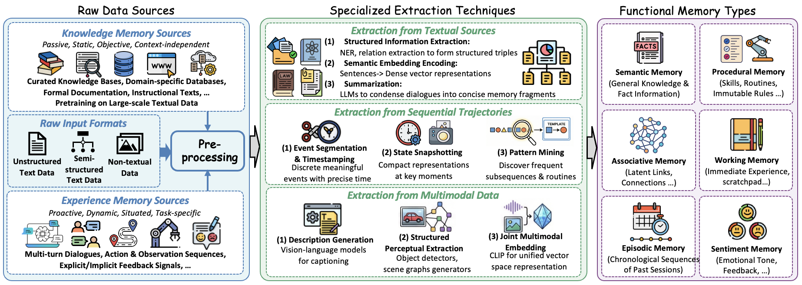

# Awesome Graph-based Agent Memory

    
    

This repository provides a comprehensive collection of research papers, benchmarks, and open-source projects on **Graph-based Agent Memory**. It includes contents from our survey paper 📖<em>"[**Graph-based Agent Memory: Taxonomy, Techniques, and Applications**]()"</em> and will be continuously updated.

🤗 **You are vey welcome to contribute to this repository** by launching an issue or a pull request. If you find any missing resources or come across interesting new research works, please don’t hesitate to open an issue or submit a PR!

📫 **Contact us via emails:** `chang.yang@connect.polyu.hk`

---

<h3 align="center">
       

    
<em>Overview of Agent Memory </em>

## 📜 Catalog

> **[Awesome Graph-based Agent Memory](#awesome-graph-based-agent-memory)**
>
> - **[🔥 News](#-news)**
> - **[📖 Overview](#-overview)**
> - **[🪴 Taxonomy](#-taxonomy)**
>   - [Memory Extraction](#memory-extraction)
>   - [Memory Storage](#memory-storage)
>   - [Memory Retrieval](#memory-retrieval)
>   - [Memory Evolution](#memory-evolution)
> - **[📦 Projects](#-projects)**
> - **[📃 Citation](#-citation)**

---

## 🔥 News

* **[2025-02-03]** 🔥🔥 Repository launched based on our survey paper.

## 🪴 Taxonomy

### Memory Extraction

### Memory Storage

### Memory Retrieval

### Memory Evolution

