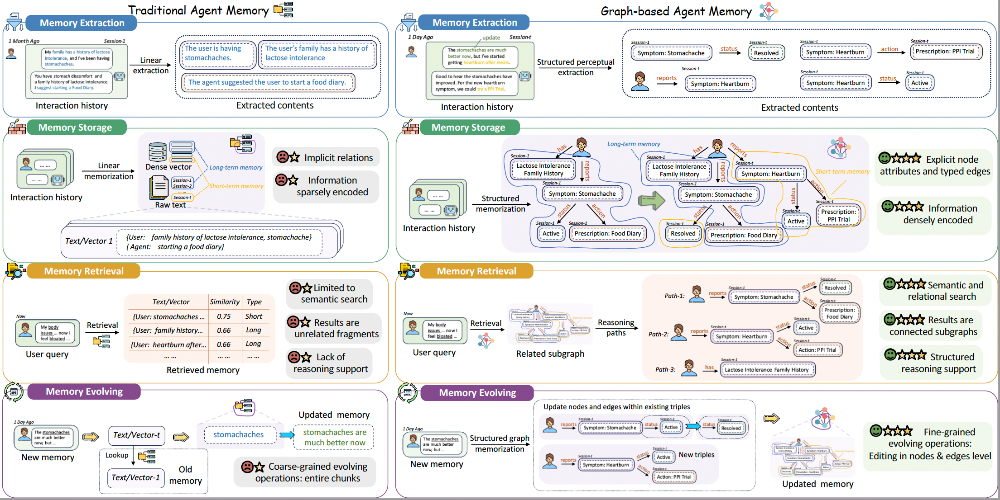
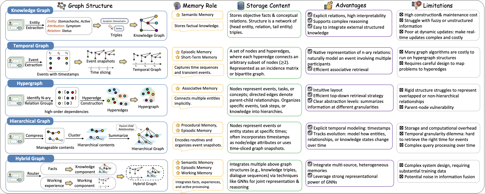
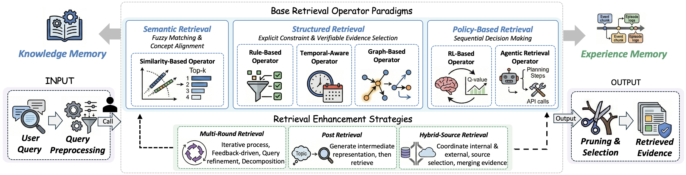
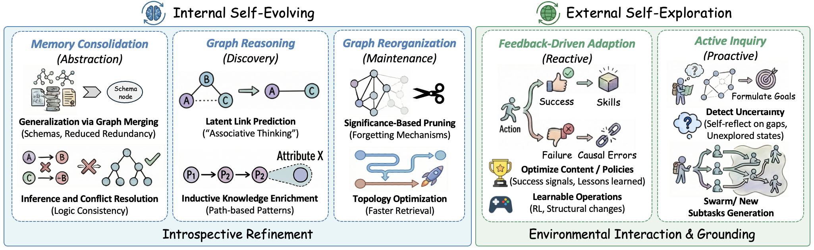

# Awesome Graph-based Agent Memory

<div align="center">
     <a href="https://arxiv.org/abs/2501.13958" target="_blank"></a>
    <a href="http://makeapullrequest.com"></a>
    <a href="http://makeapullrequest.com"></a>
    <a href="http://makeapullrequest.com"></a>
</div>

This repository provides a comprehensive collection of research papers, benchmarks, and open-source projects on **Graph-based Agent Memory**. It includes contents from our survey paper 📖<em>"[**Graph-based Agent Memory: Taxonomy, Techniques, and Applications**](https://arxiv.org/pdf/2602.05665)"</em> and will be continuously updated.

🤗 **You are vey welcome to contribute to this repository** by launching an issue or a pull request. If you find any missing resources or come across interesting new research works, please don’t hesitate to open an issue or submit a PR!

📫 **Contact us via emails:** `chang.yang@connect.polyu.hk`, `qinggang.zhang@polyu.edu.hk`

---

<div>
<h3 align="center">
       <p align="center"></p>
    <p align="center"><em>Comparison between Traditional Agent Memory and Graph-based Agent Memory.</em></p>
</div>

## 📜 Catalog

> **[Awesome Graph-based Agent Memory](#awesome-graph-based-agent-memory)**
>
> - **[🔥 News](#-news)**
> - **[📖 Overview](#-overview)**
> - **[🪴 Taxonomy](#-taxonomy)**
>   - [Memory Extraction](#memory-extraction)
>   - [Memory Storage](#memory-storage)
>   - [Memory Retrieval](#memory-retrieval)
>   - [Memory Evolution](#memory-evolution)
> - **[📦 Benchmark](#-benchmark)**
> - **[📦 Projects](#-projects)**
> - **[📃 Citation](#-citation)**

---

## 🔥 News

* **[2025-02-03]** 🔥🔥 Repository launched based on our survey paper.

## 🪴 Taxonomy
<p align="center"></p>

### Memory Extraction
- (arXiv 2025) **LinearRAG: Linear Graph Retrieval Augmented Generation on Large-scale Corpora**  [[Paper]](https://arxiv.org/abs/2510.10114)
- (EMNLP 2025) **Don’t Forget the Base Retriever! A Low-Resource Graph-based Retriever for Multi-hop Question Answering** [[Paper]](https://aclanthology.org/2025.emnlp-industry.174/)

### Memory Storage

<p align="center"></p>

### Memory Retrieval

<p align="center"></p>

### Memory Evolution

<p align="center"></p>


## 📃 Citation

```
@article{yang2026graph,
  title={Graph-based Agent Memory: Taxonomy, Techniques, and Applications},
  author={Chang Yang and Chuang Zhou and Yilin Xiao and Su Dong and Luyao Zhuang and Yujing Zhang and Zhu Wang and Zijin Hong and Zheng Yuan and Zhishang Xiang and Shengyuan Chen and Huachi Zhou and Qinggang Zhang and Ninghao Liu and Jinsong Su and Xinrun Wang and Yi Chang and Xiao Huang},
  journal={arXiv preprint arXiv:2602.05665},
  year={2025}
}
```
